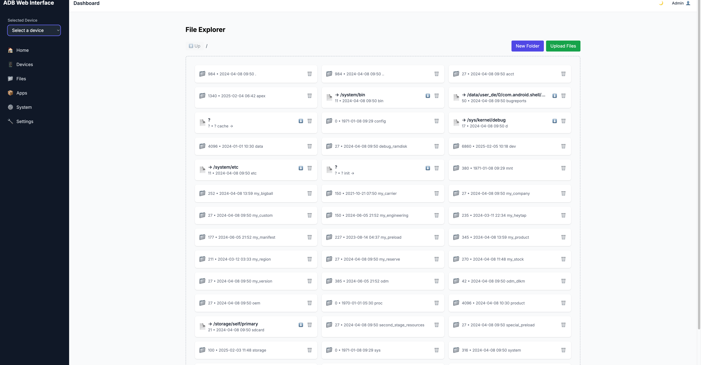

# ADB Web Interface

A modern web interface for Android Debug Bridge (ADB) that makes it easy to manage and debug Android devices from your browser.

## Features

- 📱 Device Management
  - View connected devices
  - Device information and stats
  - System controls (reboot, etc.)
- 📦 App Management
  - Install/Uninstall apps
  - View installed applications
  - App info and details
- 🖼️ Screen Capture
  - Take screenshots
  - Screen recording
- 📝 Logging
  - View device logs (logcat)
  - Filter and search logs
  - Save logs to file
- 🔧 System Tools
  - View system information
  - Page source viewer
  - Device diagnostics

## Screenshots

You can find screenshots of the application in the `screenshots` directory. These screenshots showcase various features and the user interface of the ADB Web Interface.





## Installation

You can use ADB Web Interface directly with npx (recommended):

```bash
npx adb-web
```

Or install it globally:

```bash
npm install -g adb-web
adb-web
```

### Prerequisites

- Node.js >= 18.0.0
- Android Debug Bridge (adb) installed and in your system PATH
- USB debugging enabled on your Android device

## Usage

1. Connect your Android device via USB or start an emulator
2. Enable USB debugging on your device
3. Run the ADB Web Interface:
   ```bash
   npx adb-web
   ```
4. Open your browser and navigate to the displayed URL (default: http://localhost:3000)

The web interface will automatically detect your connected devices and provide a user-friendly interface to manage them.

## Development

To run the project locally for development:

```bash
# Clone the repository
git clone https://github.com/saleehk/adb-web.git
cd adb-web

# Install dependencies
npm install

# Start development server
npm run dev
```

## Contributing

Contributions are welcome! Please feel free to submit a Pull Request.

1. Fork the repository
2. Create your feature branch (`git checkout -b feature/AmazingFeature`)
3. Commit your changes (`git commit -m 'Add some AmazingFeature'`)
4. Push to the branch (`git push origin feature/AmazingFeature`)
5. Open a Pull Request

## License

This project is licensed under the MIT License - see the [LICENSE](LICENSE) file for details.

## Author

- **saleehk** - [GitHub](https://github.com/saleehk)

## Acknowledgments

- Built with [Next.js](https://nextjs.org/)
- UI components from [Radix UI](https://www.radix-ui.com/)
